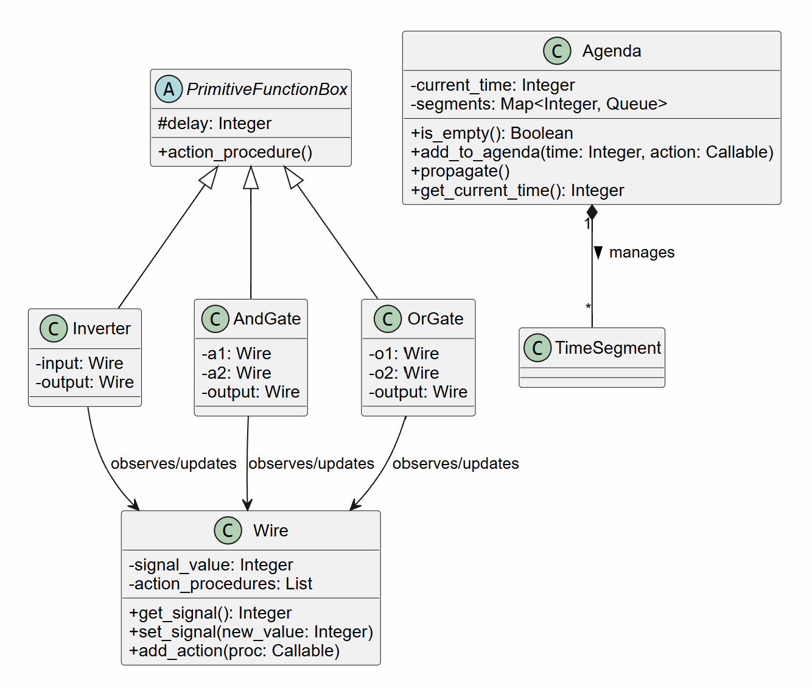
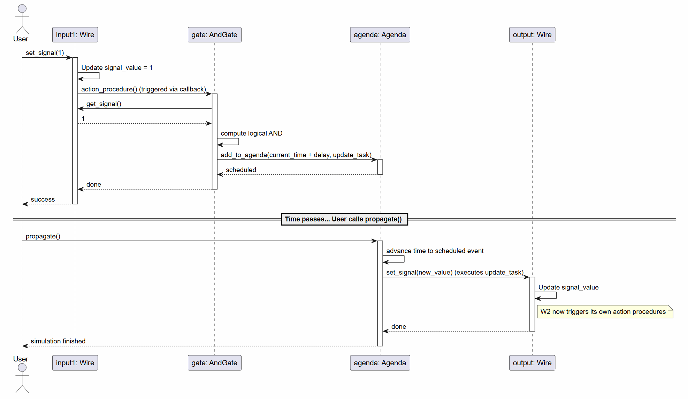
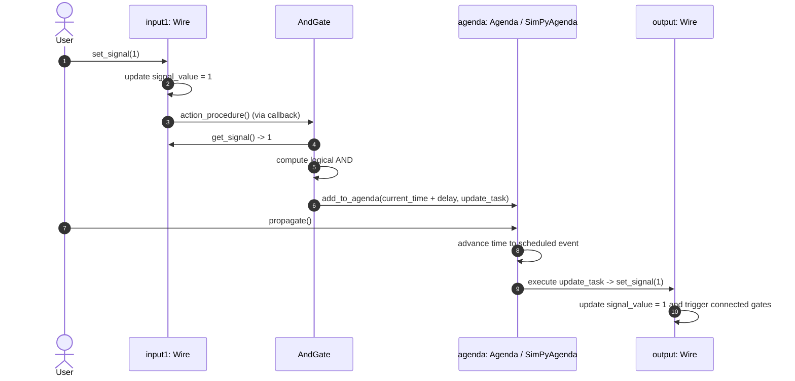
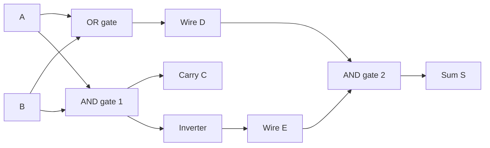

# SICP Digital Circuit Simulator

A discrete-event digital circuit simulator implemented in Python, based on the classic design presented in Chapter 3.3.4 (*"A Simulator for Digital Circuits"*) of **Structure and Interpretation of Computer Programs (SICP)** by Harold Abelson and Gerald Jay Sussman with Julie Sussman, enhanced with **SimPy** Discrete-Event Simulation capabilities.

The simulator models digital hardware where signals travel through interconnected wires, logic gates introduce realistic propagation delays, and an agenda scheduler manages discrete simulation time. It supports both the native SICP functional engine and an enhanced **SimPy** execution backend with process-based generators, clocking, and real-time pacing.

---

## Architectural Diagrams

### Class Diagram


### Sequence Diagram


---

## Functional Programming Principles & SimPy Integration

### 1. SICP Functional Foundations
- **Procedural Data Abstraction & Closures (Message Passing)**:
  Computational objects such as `Wire`, `Agenda`, and `Queue` encapsulate local state via lexical closures and provide message-passing dispatch functions (e.g. `wire("get_signal")`, `agenda("propagate")`).
- **First-Class Procedures**:
  Logic gates register callback actions (zero-argument procedures) with input wires. These action procedures are scheduled on the agenda and passed around as first-class values.
- **Higher-Order Functions**:
  Procedures like `call_each` iterate over action lists, higher-order constructors connect logic gates, and probe recorders wrap arbitrary observation callbacks.
- **Dual Interface**:
  The library exposes pure functional/procedural functions (`make_wire`, `get_signal`, `set_signal`, `add_to_agenda`, `propagate`) as well as idiomatic Python object/method access (`wire.get_signal()`, `agenda.propagate()`, `len(queue)`).

### 2. SimPy Discrete-Event Simulation Enhancements
- **Drop-in SimPy Engine**: `SimPyAgenda` wraps `simpy.Environment` while matching the SICP Agenda message dispatch and procedural API.
- **Process Generators**: Allows modeling asynchronous generators (e.g., continuous clock pulses and patterned input stimuli).
- **Sequential Logic & Memory**: Supports clocked sequential circuits (D Flip-Flops, T Flip-Flops, SR Latches, Binary Counters).
- **Real-Time Pacing**: `make_realtime_agenda(factor=...)` allows pacing discrete simulation ticks against real wall-clock time using `simpy.rt.RealtimeEnvironment`.

---

## Core Components

| Component | Module | Description |
|---|---|---|
| **`Wire`** | [`circuit_sim.wire`](circuit_sim/wire.py) | Maintains a boolean signal (0 or 1) and a list of action procedures triggered on transitions. |
| **`Queue`** | [`circuit_sim.queue`](circuit_sim/queue.py) | FIFO queue data structure used inside time segments. |
| **`Agenda`** | [`circuit_sim.agenda`](circuit_sim/agenda.py) | Priority event schedule holding time-ordered segments and orchestrating simulation progress. |
| **`SimPyAgenda`** | [`circuit_sim.simpy_agenda`](circuit_sim/simpy_agenda.py) | SimPy-powered discrete-event scheduler with process generator support. |
| **`PrimitiveFunctionBox`** | [`circuit_sim.gates`](circuit_sim/gates.py) | Base abstraction for primitive gates introducing propagation delays. |
| **Gates** | [`circuit_sim.gates`](circuit_sim/gates.py) | `inverter`, `and_gate`, `or_gate`, `nand_gate`, `nor_gate`, `xor_gate`, `compound_or_gate`. |
| **Combinational Circuits** | [`circuit_sim.circuits`](circuit_sim/circuits.py) | `half_adder`, `full_adder`, `ripple_carry_adder`, `multiplexer`, `demultiplexer`. |
| **Sequential Circuits** | [`circuit_sim.sequential`](circuit_sim/sequential.py) | `sr_latch`, `d_latch`, `d_flip_flop`, `t_flip_flop`, `binary_counter`. |
| **Generators & Clocks** | [`circuit_sim.simpy_agenda`](circuit_sim/simpy_agenda.py) | `clock_generator`, `pulse_generator`, `signal_schedule`. |
| **`probe`** | [`circuit_sim.probe`](circuit_sim/probe.py) | Attaches a monitor to a wire that logs signal changes with exact simulation timestamps. |
| **`Delays`** | [`circuit_sim.delays`](circuit_sim/delays.py) | Propagation delay configuration (defaults: Inverter = 2, AND = 3, OR = 5). |

---

## How the Simulation Works



1. **Initialization**: Wires are initialized with signal `0`.
2. **Registration**: When a logic gate or probe connects to a wire via `add_action(wire, proc)`, the action procedure is executed immediately to synchronize initial states.
3. **Signal Transition**: Calling `set_signal(wire, val)` checks if the signal value actually changes. If it does, all registered action procedures are invoked.
4. **Event Scheduling**: Gates calculate the new output logically and schedule delayed output updates via `after_delay(delay, action, agenda)`.
5. **Propagation**: `propagate(agenda)` pops and executes events in chronological order, advancing `current_time` until no scheduled events remain.

---

## Gate Delays (SICP 3.3.4 Defaults)

| Gate | Delay Units | Description |
|---|---|---|
| **Inverter** | 2 | `output = NOT input` |
| **AND Gate** | 3 | `output = a1 AND a2` |
| **OR Gate** | 5 | `output = o1 OR o2` |
| **NAND Gate** | 3 | `output = NOT (a1 AND a2)` |
| **NOR Gate** | 5 | `output = NOT (o1 OR o2)` |
| **XOR Gate** | 8 | `output = a1 XOR a2` |
| **Compound OR (De Morgan)** | 7 | `NOT (NOT a1 AND NOT a2)` (2 * Inverter + AND) |

---

## Circuit Examples & Usage

### 1. Half-Adder (SICP 3.3.4 Walkthrough)

The half-adder computes the sum $S = A \oplus B$ and carry $C = A \cdot B$ using an OR gate, an AND gate, an Inverter, and a second AND gate:



```python
from circuit_sim import make_agenda, make_wire, probe, half_adder, set_signal, propagate

# 1. Initialize agenda and wires
the_agenda = make_agenda()
input_1 = make_wire("input-1")
input_2 = make_wire("input-2")
sum_wire = make_wire("sum")
carry_wire = make_wire("carry")

# 2. Attach probes to monitor transitions
probe("sum", sum_wire, agenda=the_agenda)
probe("carry", carry_wire, agenda=the_agenda)

# 3. Construct the circuit
half_adder(input_1, input_2, sum_wire, carry_wire, agenda=the_agenda)

# 4. Set input-1 to 1 and run simulation
set_signal(input_1, 1)
propagate(the_agenda)
# Output:
# sum 8  New-value = 1

# 5. Set input-2 to 1 and run simulation
set_signal(input_2, 1)
propagate(the_agenda)
# Output:
# carry 11  New-value = 1
# sum 16  New-value = 0
```

---

### 2. Full-Adder

A full-adder adds three 1-bit inputs ($A$, $B$, $C_{in}$) using two half-adders and an OR gate:

```python
from circuit_sim import make_agenda, make_wire, full_adder, set_signal, propagate, get_signal

agenda = make_agenda()
a = make_wire("A")
b = make_wire("B")
c_in = make_wire("Cin")
s = make_wire("Sum")
c_out = make_wire("Cout")

full_adder(a, b, c_in, s, c_out, agenda=agenda)

set_signal(a, 1)
set_signal(b, 1)
set_signal(c_in, 1)
propagate(agenda)

print(f"Sum = {get_signal(s)}, Cout = {get_signal(c_out)}")
# Output: Sum = 1, Cout = 1 (1 + 1 + 1 = 3 -> 0b11)
```

---

### 3. n-Bit Ripple-Carry Adder (SICP Exercise 3.30)

Cascades $n$ full-adders to perform multi-bit binary addition using bus utilities:

```python
from circuit_sim import make_agenda, make_bus, make_wire, ripple_carry_adder, set_bus_values, get_bus_values, get_signal, propagate

agenda = make_agenda()
width = 8

# Create 8-bit buses
a_bus = make_bus(width, "A")
b_bus = make_bus(width, "B")
sum_bus = make_bus(width, "Sum")
c_out = make_wire("Cout")

ripple_carry_adder(a_bus, b_bus, sum_bus, c_out, agenda=agenda)

# Set A = 42 (0b00101010), B = 27 (0b00011011)
set_bus_values(a_bus, 42)
set_bus_values(b_bus, 27)
propagate(agenda)

sum_val = sum(bit << i for i, bit in enumerate(get_bus_values(sum_bus)))
print(f"Result: {sum_val} (Carry-out: {get_signal(c_out)})")
# Output: Result: 69 (Carry-out: 0)
```

---

### 4. SimPy Clock Generator & Sequential D Flip-Flop

Using SimPy's process engine to drive an edge-triggered D Flip-Flop with periodic clock pulses:

```python
from circuit_sim import (
    make_simpy_agenda, make_wire, probe,
    clock_generator, pulse_generator, d_flip_flop, get_signal
)

agenda = make_simpy_agenda()
clk = make_wire("CLK")
d = make_wire("D")
q = make_wire("Q")
q_bar = make_wire("Q_BAR")

probe("CLK", clk, agenda=agenda)
probe("D  ", d, agenda=agenda)
probe("Q  ", q, agenda=agenda)

# Positive-edge-triggered Master-Slave D Flip-Flop
d_flip_flop(d, clk, q, q_bar, agenda=agenda)

# Start clock process (period = 20) and data pulse stimulus
clock_generator(agenda, clk, high_duration=10, low_duration=10, cycles=5)
pulse_generator(agenda, d, sequence=[(15, 0), (20, 1), (25, 0)])

# Propagate all scheduled events
agenda.propagate()
```

---

## Directory Structure

```
perf_sim/core/
│
├── circuit_sim/               # Core simulator package
│   ├── __init__.py           # Package exports
│   ├── delays.py             # Propagation delay configuration
│   ├── queue.py              # Functional Queue closure & message passing
│   ├── wire.py               # Functional Wire closure & bus helpers
│   ├── agenda.py             # SICP Agenda & propagate event loop
│   ├── simpy_agenda.py       # SimPy-backed Agenda, clocks & stimulus generators
│   ├── gates.py              # Logic gates & PrimitiveFunctionBox
│   ├── circuits.py           # Combinational circuits (adders, mux/demux)
│   ├── sequential.py         # Sequential circuits (latches, flip-flops, counter)
│   └── probe.py              # Wire monitoring probe & test recorder
│
├── examples/                 # Executable walkthrough scripts
│   ├── half_adder_demo.py    # Step-by-step SICP Section 3.3.4 demo
│   ├── full_adder_demo.py    # Full-adder truth table verification
│   ├── ripple_carry_adder_demo.py  # 8-bit ripple-carry adder simulation
│   ├── simpy_clocked_counter_demo.py # SimPy clock & D flip-flop demo
│   └── simpy_benchmark_demo.py # Benchmark comparing SICP vs SimPy agenda
│
├── tests/                    # Comprehensive unit & integration tests
│   ├── test_queue.py         # Queue tests
│   ├── test_wire.py          # Wire signal & action tests
│   ├── test_agenda.py        # Event scheduler tests
│   ├── test_simpy_agenda.py  # SimPy agenda & sequential circuits tests
│   ├── test_gates.py         # Logic gates & delays tests
│   ├── test_circuits.py      # Combinational circuit tests
│   └── test_probe.py         # Probe & recorder tests
│
├── doc/                      # Architecture diagrams
│   ├── uml_class_circuit_sim.png
│   └── uml_sequence_circuit_sim.png
│
└── README.md                 # Project documentation
```

---

## Running Demos and Tests

### Running the Tests
Run the full test suite (43 tests) using `pytest`:
```bash
python -m pytest -v
```

### Running Example Demos
```bash
# Run SICP 3.3.4 Half-Adder Walkthrough
python examples/half_adder_demo.py

# Run Full-Adder Truth Table Demo
python examples/full_adder_demo.py

# Run 8-Bit Ripple-Carry Adder Demo
python examples/ripple_carry_adder_demo.py

# Run SimPy Clocked Sequential Circuit Demo
python examples/simpy_clocked_counter_demo.py

# Run Engine Performance Benchmark
python examples/simpy_benchmark_demo.py
```

---

## References
- **SICP Chapter 3.3.4**: *"A Simulator for Digital Circuits"* (Harold Abelson & Gerald Jay Sussman)
- **SICP Exercise 3.28**: Implementation of `or-gate`
- **SICP Exercise 3.29**: Construction of `or-gate` from `and-gate` and `inverter` (De Morgan's Laws)
- **SICP Exercise 3.30**: Construction of `ripple-carry-adder`
- **SimPy Framework**: Process-based discrete-event simulation framework for Python